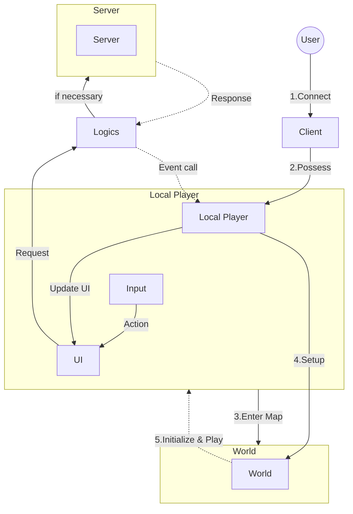

# MScannot206&nbsp;

이 프로젝트는 메이플스토리 월드에서의 기능 개발을 위해 만들어졌습니다.

[메이플스토리 월드 크리에이터 이용약관](https://github.com/dek0058/MScannot206)을 준수하며, 해당 프로젝트는 비공식 프로젝트임을 알립니다.

## 목차

- [📋 요구사항](#-요구사항)
- [🏗️ 아키텍처](#️-아키텍처)

## 📋 요구사항

 - [메이플스토리월드](https://maplestoryworlds.nexon.com/)
 - [MScannot206Server](https://github.com/dek0058/MScannot206Server) (전용 서버 프로그램)

## 🏗️ 아키텍처

### 메인

