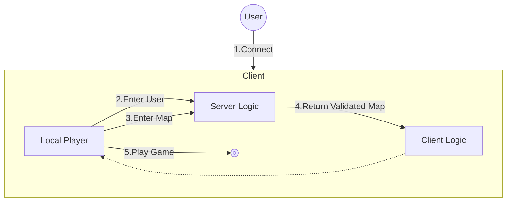

# MScannot206&nbsp;

이 프로젝트는 메이플스토리 월드에서의 기능 개발을 위해 만들어졌습니다.

[메이플스토리 월드 크리에이터 이용약관](https://github.com/dek0058/MScannot206)을 준수하며, 해당 프로젝트는 비공식 프로젝트임을 알립니다.

## 목차

- [📋 요구사항](#-요구사항)
- [🏗️ 아키텍처](#️-아키텍처)

## 📋 요구사항

 - [메이플스토리월드](https://maplestoryworlds.nexon.com/)
 - [MScannot206Server](https://github.com/dek0058/MScannot206Server) (전용 서버 프로그램)

## 🏗️ 아키텍처

### 기본 구조

1. 유저 게임 접속 (1️⃣) 유저는 클라이언트에 접속하여 `LocalPlayer` 객체를 생성 합니다.

2. 유저가 게임에 입장(2️⃣) 유저가 게임에 입장하면 `ServerLogic`에서 접속된 유저의 상태를 확인 합니다.

3. 유저가 맵에 입장 (3️⃣) 유저가 맵에 입장하면 `ServerLogic`에서 맵에 진입 했음을 알림니다.

4. 유저&맵 유효성 검사 (4️⃣) `ServerLogic`에서 유저의 상태와 맵의 유호성을 검사 후 `ClientLogic`을 통해 `LocalPlayer`에게 알림니다.
    - 로그인에 성공한 유저의 경우 로그인 프로세스를 건너 뜁니다.
    - 만약 그렇지 않다면 로그인 맵 혹은 로그인 프로세스를 진행 합니다.

5. 게임 플레이 (5️⃣) 유저는 `Play` 상태에서 게임을 플레이 합니다.

---

### 상세 구조
 - [로그인](./document/feature/login.md) - 로그인 기능에 대한 상세 구조입니다.
 - [캐릭터 선택창](./document/feature/character_selection.md) - 캐릭터 선택창 기능에 대한 상세 구조입니다.
