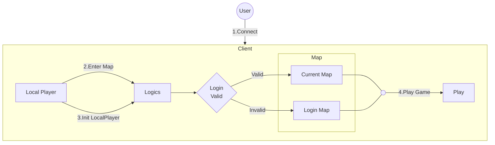

# MScannot206&nbsp;

이 프로젝트는 메이플스토리 월드에서의 기능 개발을 위해 만들어졌습니다.

[메이플스토리 월드 크리에이터 이용약관](https://github.com/dek0058/MScannot206)을 준수하며, 해당 프로젝트는 비공식 프로젝트임을 알립니다.

## 목차

- [📋 요구사항](#-요구사항)
- [🏗️ 아키텍처](#️-아키텍처)

## 📋 요구사항

 - [메이플스토리월드](https://maplestoryworlds.nexon.com/)
 - [MScannot206Server](https://github.com/dek0058/MScannot206Server) (전용 서버 프로그램)

## 🏗️ 아키텍처

### 기본 구조

1. 게임 접속 및 초기화 (1️⃣) 사용자(User)가 클라이언트에 접속하면, 가장 먼저 Local Player가 활성화됩니다. Local Player는 게임 로직을 담당하는 Logics에게 맵 입장과 플레이어 초기화를 요청하며 본격적인 게임 시작을 준비합니다.

2. 로그인 검증 (2️⃣) Logics는 플레이어의 요청을 받아 이 사용자가 유효한지 확인하기 위해 Login Valid 검증 절차를 진행합니다.

3. 게임 진행 (3️⃣) 로그인 검증 결과에 따라 플레이어의 다음 상태가 결정됩니다.
    - 로그인이 유효하면 (Valid), 플레이어는 이전에 플레이하던 Current Map으로 진입합니다.
    - 로그인이 유효하지 않으면 (Invalid), 플레이어는 계정 정보를 입력해야 하는 Login Map으로 이동됩니다.

### 상세 구조
 - [로그인](./document/feature/login.md) - 로그인 기능에 대한 상세 구조입니다.
 - [캐릭터 선택창](./document/feature/character_selection.md) - 캐릭터 선택창 기능에 대한 상세 구조입니다.
