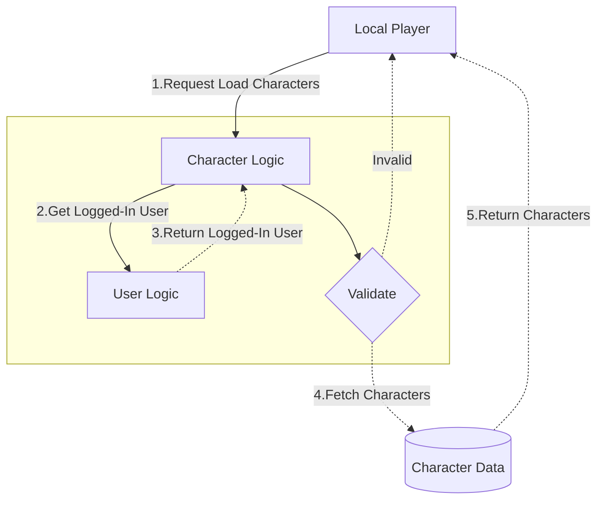
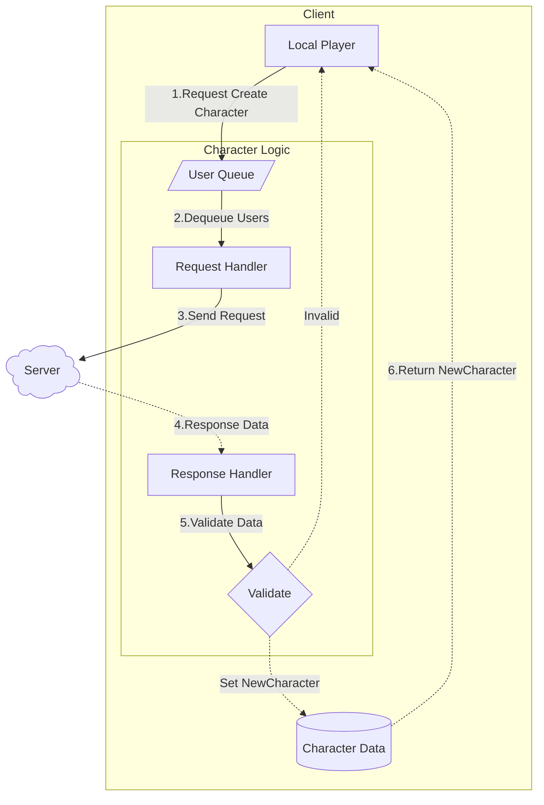
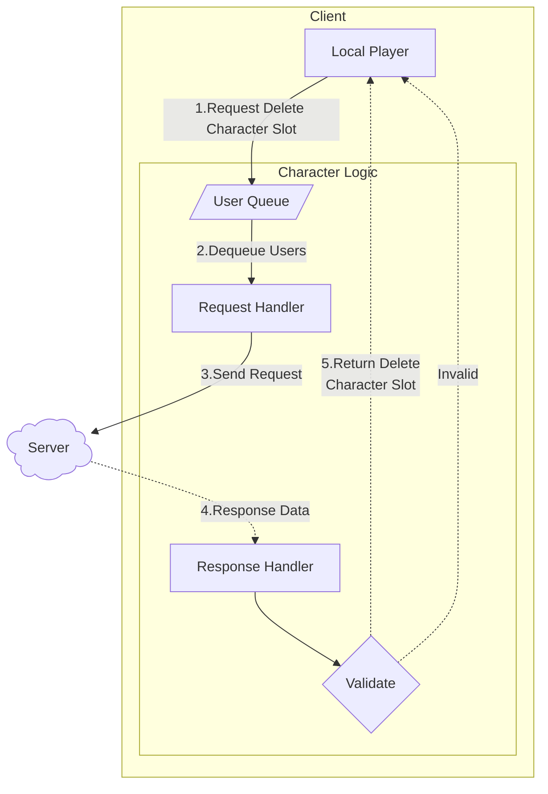

# 캐릭터 선택창

본 문서는 게임 내 캐릭터 선택창의 기능과 구현 방법에 대해 설명합니다.

## 1. 캐릭터 슬롯 불러오기

1. 캐릭터 불러오기 요청 (1️⃣) `LocalPlayer`가 캐릭터 불러오기 요청을 하면, `CharacterLogic`에서 처리합니다.

2. 로그인된 유저 정보 가져오기 (2️⃣-3️⃣) `CharacterLogic`은 `UserLogic`에 로그인된 유저 정보를 요청하고 반환받습니다.

3. 유효성 검사 (4️⃣) `CharacterLogic`은 반환받은 유저 정보를 바탕으로 유효성을 검사합니다.
    - 유효하지 않은 경우: `LocalPlayer`에게 알림을 보냅니다.
    - 유효한 경우: `CharacterData`에서 해당 유저의 캐릭터 슬롯 정보를 가져옵니다.

4. 캐릭터 슬롯 반환 (5️⃣) `CharacterData`에서 가져온 캐릭터 슬롯 정보를 `LocalPlayer`에게 반환합니다.
    - 만약 Backend 서버로부터 받은 캐릭터 정보가 `CharacterData`에 없다면 신규 캐릭터를 생성하여 반환합니다.

## 2. 캐릭터 생성

1. 캐릭터 생성 요청 큐 추가 (1️⃣) `User`가 캐릭터 생성 요청을 하면, `UsersQueue`에 추가됩니다.

2. 일괄 처리 (2️⃣-3️⃣) 시스템 설정에 정의된 배치 간격마다 큐에서 일괄적으로 서버에 캐릭터 생성 요청을 보냅니다.

3. 응답 검증 (4️⃣-5️⃣) 서버로부터 응답이 오면, 응답 데이터로부터 유효성을 검사합니다.

4. 캐릭터 생성 완료 또는 실패 (6️⃣)
	- 유효한 경우: 유저의 `CharacterData`에 새로 생성된 캐릭터 정보를 저장하고 `LocalPlayer`에게 알림을 보냅니다.
	- 유효하지 않은 경우: `LocalPlayer`에게 알림을 보냅니다.

## 3. 캐릭터 제거

1. 캐릭터 제거 요청 큐 추가 (1️⃣) User가 캐릭터 제거 요청을 하면, UsersQueue에 추가됩니다.

2. 일괄 처리 (2️⃣-3️⃣) 시스템 설정에 정의된 배치 간격마다 큐에서 일괄적으로 서버에 캐릭터 제거 요청을 보냅니다.

3. 응답 검증 (5️⃣) 서버로부터 응답이 오면, 응답 데이터로부터 유효성을 검사합니다. 그리고 `LocalPlayer`에게 결과를 알립니다.
    - 백엔드 서버로 부터 캐릭터 정보가 삭제되었기 때문에 클라이언트 측에서 별도로 관리하는 서버 데이터베이스에서는 제거 작업을 수행하지 않습니다.

