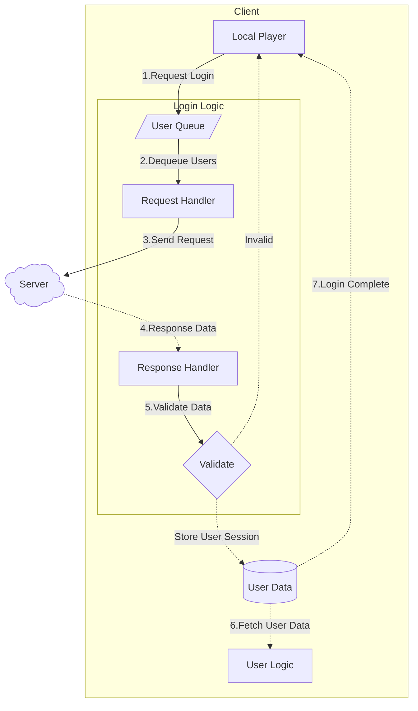

# 로그인

본 문서에서는 로그인 기능과 구현 방법에 대해 설명합니다.

## 기본 구조

1. 로그인 요청 큐 추가 (1️⃣) User가 로그인 요청을 하면, UsersQueue에 추가됩니다.

2. 일괄 처리 (2️⃣-3️⃣) 시스템 설정에 정의된 배치 간격마다 큐에서 일괄적으로 서버에 로그인 요청을 보냅니다.

3. 응답 검증 (4️⃣-5️⃣) 서버로부터 응답이 오면, 응답 데이터로부터 유효성을 검사합니다.

4. 로그인 완료 또는 실패 (6️⃣-7️⃣)
	- 유효한 경우: UserData에 유저 세션을 저장하고 UserLogic에 전달하며, 로그인 과정이 완료됩니다.
	- 유효하지 않은 경우: LocalPlayer에게 알림을 보냅니다.

